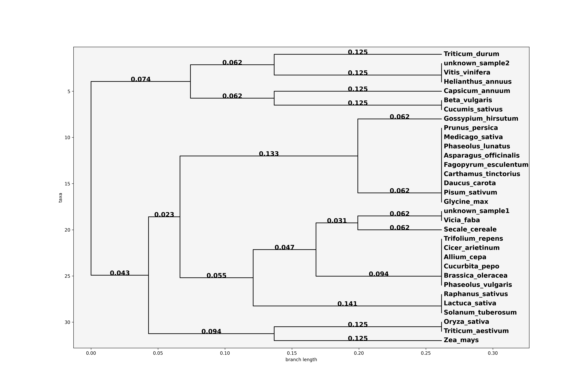

# Cladevo
#### Cladevo is a tool for constructing phylogenetic trees, enabling rapid analysis of genetic data. It is designed for researchers, educators, and students who need a simple and accessible solution for phylogenetic analysis without using advanced software.

#### Create trees quickly and efficiently with minimal effort. 
#### Example:

## Table of Contents

### [Overview](#overview)  
### [Demo Video](#demo-video)  
### [Features & Functionality](#features--functionality)  
### [Installation & Setup](#installation--setup)  
### [Usage](#usage)  
### [Educational Resources](#educational-resources)  
### [License](#license)  
### [Contributing](#contributing)  
### [Acknowledgments](#acknowledgments)  

## Overview

Cladevo is an online tool designed for constructing phylogenetic trees using the UPGMA (Unweighted Pair Group Method with Arithmetic Mean) and Neighbor-Joining (NJ) algorithms. It allows users to generate dendrograms quickly based on flexible data input methods, including FASTA files, Excel files, or manual DNA sequence input.

This tool is ideal for researchers, educators, and students who need an accessible solution for phylogenetic analysis. Scientists can use Cladevo for preliminary data exploration before transitioning to more advanced bioinformatics tools like MEGA or DarWin, while students can gain hands-on experience with phylogenetic tree construction.

## Demo Video

Watch the Cladevo presentation and example workflow (Replace with actual video link)

## Features & Functionality

* Phylogenetic Tree Construction: Supports Neighbor-Joining (NJ) and UPGMA algorithms for genetic relationship analysis.

* Flexible Data Input: Accepts FASTA files, Excel files, or manually entered DNA sequences.

* Automated Processing: Sequence alignment, dissimilarity matrix calculation, and dendrogram construction are fully automated.

* Molecular Marker Analysis: Compatible with SSR genotyping, PCR, and gel electrophoresis data.

* Speed & Accessibility: No installation required; generate trees in seconds.

* Educational Resources: Learn about UPGMA and NJ algorithms in the Theory section.

* Completely Free: No subscription, authentication, or ads—just an open-access tool for all users.

## Installation & Setup

#### Cladevo is currently unavailable via the web but can be downloaded and installed using the Docker image, available here: [link].
#### For installation and running instructions, please refer to the Docker documentation, which provides detailed guidance on how to install Docker and run Docker images on your local machine: [Docker Installation and Running Guide](https://docs.docker.com/get-docker/)

## Usage

* Upload Your Data: Choose a FASTA or Excel file, or manually enter sequences.

* Select Algorithm: Choose between UPGMA and Neighbor-Joining.

* Generate Tree: Click the Generate button and get your phylogenetic tree instantly.

* Download Results: Save the tree visualization for further analysis.

## Educational Resources

Cladevo provides learning materials to help users understand the underlying algorithms:

* Theory Section: Learn about UPGMA and Neighbor-Joining.

* How to Use Section: Watch video tutorials on using Cladevo effectively.

(The sections are available inside the app after installation.)

## License

This project is released under the [MIT License](https://opensource.org/license/MIT), allowing users to freely use, modify, and distribute Cladevo's code while retaining the original copyright notice. However, Cladevo's frontend is built using an [HTML5 UP](https://html5up.net/) template, which falls under the [Creative Commons Attribution 3.0 License](https://html5up.net/license)—proper credit must be given to HTML5 UP if frontend components are used or modified.

## Contributing

Cladevo is an open-source project. Contributions are welcome! If you’d like to improve the tool, feel free to submit pull requests or report issues.

## Acknowledgments

Cladevo was created to provide an easy-to-use solution for phylogenetic analysis, bridging the gap between complex bioinformatics software and beginners in the field. We appreciate contributions and feedback from the community to enhance its functionality.

Happy analyzing with Cladevo! 🚀
